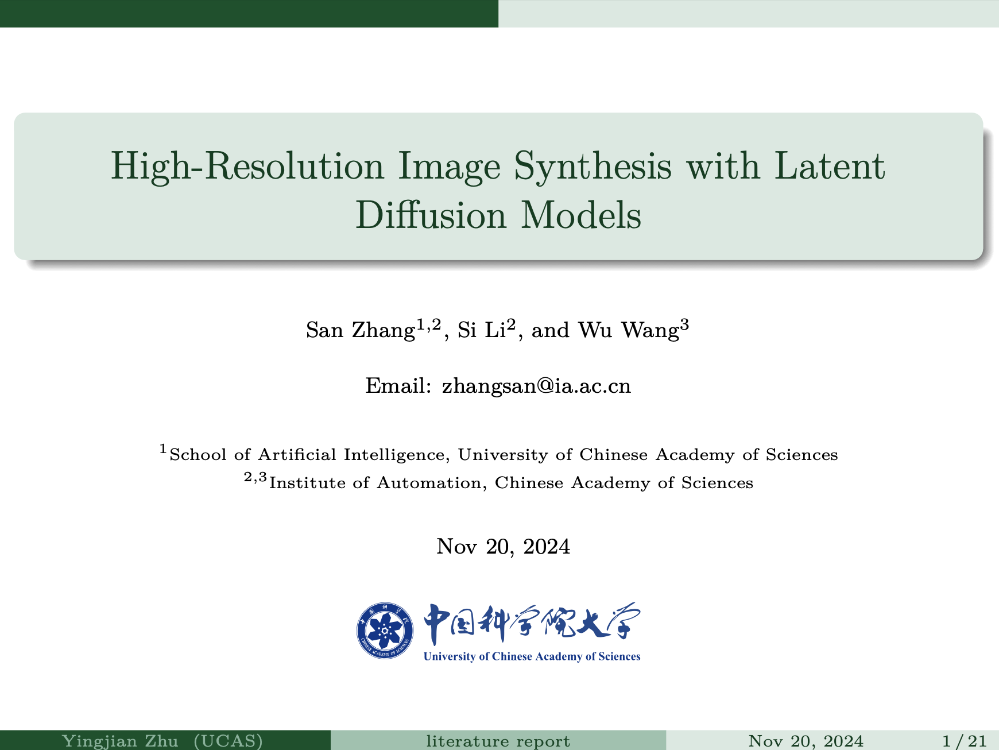
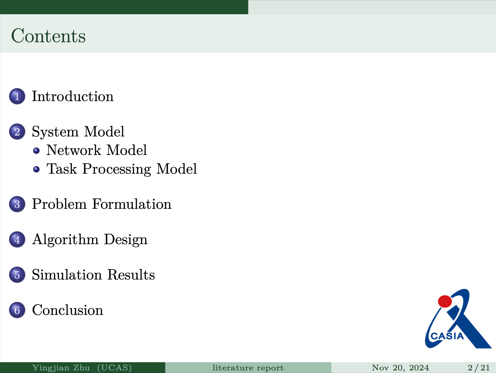
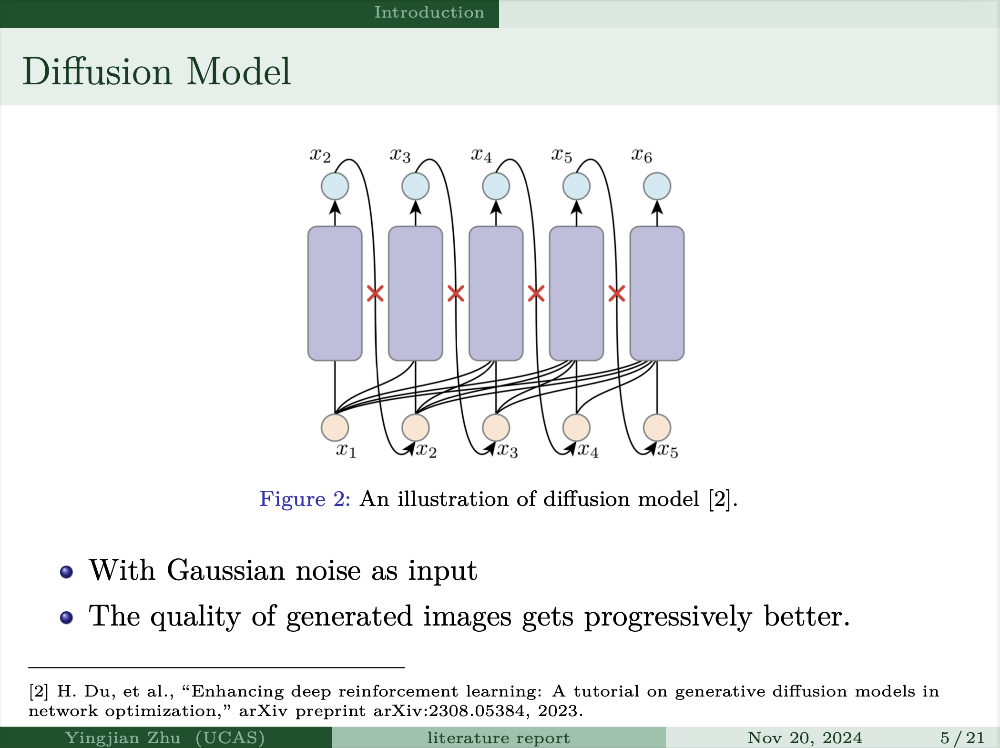

## 一份中国科学院大学的beamer模板

- 粗略做了一版，后面应该会更新……

- 目录部分做了两个版本，可以仍然继续使用学校的logo

- 个人感觉绿色挺清新挺好看的，不喜欢的话可以在[这个网站](https://hartwork.org/beamer-theme-matrix/)上挑自己喜欢的样式，不同行代表不同的样式，不同列代表不同的color theme. 挑选好后，直接修改main.tex中的这部分即可

  ```tex
  \usetheme{CambridgeUS}
  \usecolortheme{spruce}
  ```

  








> 参考https://www.zhihu.com/question/526987978/answer/3505739406